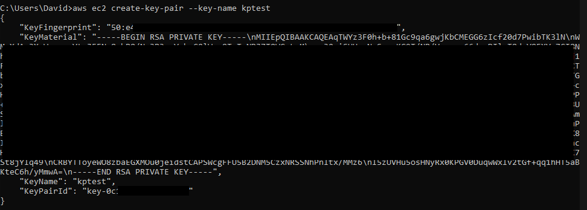
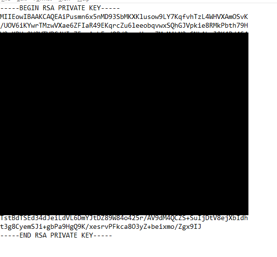
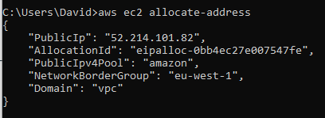
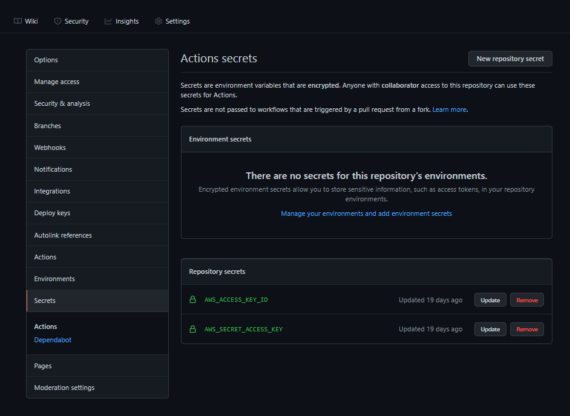
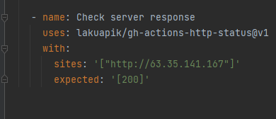

# cloudFormationDeploy

## Requirements
 - AWS cli configured with region (I used eu-west-1 so i'd recommend using that)
 - KeyPair
   - An SSH keypair which you have access to, which is also available in the deployment region
   - To create and add a key-pair to your region, enter the following into your cli
     - aws ec2 create-key-pair --key-name aws-eb
   - You should get a response looking like this:
 
 
   - Copy the KeyMaterial data into a file which you call aws-eb.pem, it should look like this:  
 
 
 - ElasticIp
   - To create an elastic IP go into the AWS console run the following command (Naming it is optional)
   - `aws ec2 allocate-address`
   - The response should be similar to this one:
 
 
   - copy the AllocationId into the ElasticIP resource near the bottom of the template
   - Machine Image recipe
     - This we'll do in the console, as doing this in the cli is a world of pain
     - Go to EC2 Image Builder in the console, and click create image pipeline
     - Fill in the form on the first page, but set scheduling options to manual to avoid blasting past the free-tier storage capacity
     - On the next page click create new recipe, use the AMI output type, set a name and version, not important what you call it
     - For the OS, Ubuntu, and pick Ubuntu server LTS 20 x86 for the image origin
     - Click create component on build components
       - Give the component a name, i called mine nGinx, and give it a version
       - Then, copy the contents of [NGINXComponent](./NGINXComponent.yml).
       - Click create component
     - List components "Owned by me", and add your new component
     - Then you add the following test components
       - reboot-linux
       - apt-repository-test
     - Now click your way through the rest of the setup (Just click next)
     - Click your pipeline, actions, run pipeline.
     - After a while (usually takes quite a while) you end up with an image, compy its imageid and paste it into the template
     - Pipeline to get ImageId 
   - IAM role & credentials for workflows
     - Create a new IAM role with the recommended policies and make sure you enable programmatic access and store the csv
     - Recommended policies
       - AmazonEC2FullAccess
       - AWSCloudFormationFullAccess
     - Go to your github repos settings and add these secrets
       - AWS_ACCESS_KEY_ID
       - AWS_SECRET_ACCESS_KEY
     
 
   - Lastly change IP address in deploy test check server response to be your elasticIp  
