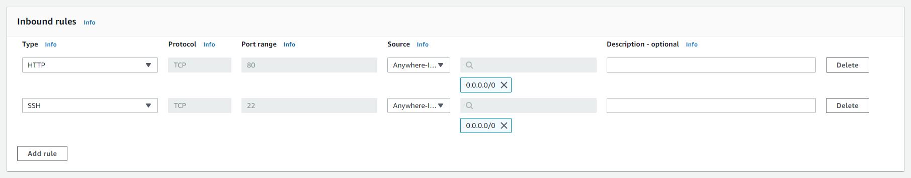

# cloudFormationDeploy

## Requirements
 - AWS cli configured with region (I used eu-west-1 so i'd recommend using that)
 - KeyPair
   - An SSH keypair which you have access to, which is also available in the deployment region
   - To create and add a key-pair to your region, enter the following into your cli
     - aws ec2 create-key-pair --key-name aws-eb
   - You should get a response looking like this:
 
 
   - Copy the KeyMaterial data into a file which you call aws-eb.pem, it should look like this:  
 
 
 - You also need a security group, which we create using the aws console to avoid having any inconsistencies or duplications
   - The reason i went with using the console is that creating a security group using the cli is just way too much of a hassle
   - Do the following steps:
     - Go to aws console -> ec2 -> network & security -> security groups -> create security group
     - Give it a name, what its called doesn't matter
     - Add inbound rules for port 80 and 22     
 
 
   - Open port 80 & 22
   - SecGroupId
 - ElasticIp
   - AllocationId
 - Machine Image recipe
   - Different tests
   - [Custom Component for nGinx](./NGINXComponent.yml)
   - Pipeline to get ImageId 
 - IAM role & credentials for workflows
   - Recommended policies
     - AmazonEC2FullAccess
     - AWSCloudFormationFullAccess
   - Add secrets to github repo
     - AWS_ACCESS_KEY_ID
     - AWS_SECRET_ACCESS_KEY
 - Change IP address in deploy test check server response to be your elasticIp